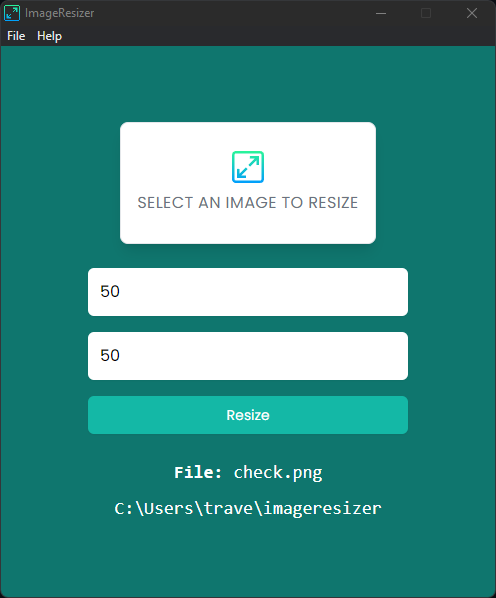

# 🖼️ Image Resizer (Electron)

A lightweight cross-platform desktop application, built with **Electron.js**, that lets you select an image, resize it to any custom width and height, and save the resized copy to a dedicated output folder on your machine.



---

## Table of Contents

- [Features](#features)
- [Tech Stack](#tech-stack)
- [Project Architecture](#project-architecture)
- [Getting Started](#getting-started)
- [Usage](#usage)
- [Project Structure](#project-structure)
- [Development History](#development-history)
- [Future Improvements](#future-improvements)
- [License](#license)

---

## Features

- 📂 Select any image (`PNG`, `JPEG`, `GIF`) directly from your file system
- 📏 Auto-detects and pre-fills the original image dimensions
- ✏️ Enter a custom width and height to resize the image
- 💾 Automatically saves the resized image to an `imageresizer` folder in your home directory
- 🔔 Toast notifications for success and validation errors
- 📁 Opens the destination folder automatically after resizing
- 🖥️ Native menu bar with an "About" window
- 🍎 Cross-platform support (Windows, macOS, Linux)

---

## Tech Stack

| Layer            | Technology                                                        |
|-------------------|--------------------------------------------------------------------|
| Desktop Shell     | [Electron.js](https://www.electronjs.org/)                        |
| Runtime           | [Node.js](https://nodejs.org/) (`fs`, `path`, `os`)                |
| Image Processing  | [`resize-img`](https://www.npmjs.com/package/resize-img)          |
| UI Notifications  | [`toastify-js`](https://www.npmjs.com/package/toastify-js)        |
| Styling           | Tailwind-style utility CSS + Google Fonts (Poppins)                |
| IPC Bridge        | Electron `contextBridge` / `ipcRenderer` / `ipcMain`               |

---

## Project Architecture

The app follows Electron's standard **multi-process architecture**, keeping Node.js privileges isolated from the UI for security:

```
┌────────────────────┐        IPC (ipcRenderer.send)        ┌──────────────────────┐
│   Renderer Process   │ ────────────────────────────────▶  │    Main Process       │
│  (index.html + UI)   │                                     │     (main.js)         │
│  renderer.js         │ ◀────────────────────────────────  │  resizeImage()         │
└────────────────────┘        IPC (image:done event)         └──────────────────────┘
          ▲
          │ contextBridge (safe API exposure)
          │
   preload.js  →  exposes window.os, window.path, window.Toastify, window.ipcRenderer
```

- **`main.js`** — Creates the app windows, builds the native menu, and listens for resize requests over IPC. Performs the actual image resizing using `resize-img` and writes the output to disk using Node's `fs` module.
- **`preload.js`** — Runs in an isolated context and safely exposes a minimal, controlled API (`os`, `path`, `Toastify`, `ipcRenderer`) to the renderer process via `contextBridge`, since `nodeIntegration` is not directly trusted in the UI layer.
- **`renderer/js/renderer.js`** — Handles all UI interactions: reading the selected file, previewing dimensions, validating input, and sending resize requests to the main process.

---

## Getting Started

### Prerequisites

- [Node.js](https://nodejs.org/) (v16 or later recommended)
- npm (comes bundled with Node.js)

### Installation

```bash
# 1. Clone the repository
git clone https://github.com/Istiak-Ahmed01/image-resizer-electron.git

# 2. Move into the project folder
cd image-resizer-electron

# 3. Install dependencies
npm install

# 4. Start the app
npm start
```

---

## Usage

1. Launch the app with `npm start`.
2. Click **"Select an image to resize"** and choose a `.png`, `.jpg`, or `.gif` file.
3. The original width and height are auto-filled — edit them to the dimensions you want.
4. Click **Resize**.
5. A success toast will appear, and the resized image will be saved to:
   ```
   ~/imageresizer/
   ```
6. The output folder opens automatically so you can view the result.

---

## Project Structure

```
image-resizer-electron/
├── assets/
│   ├── icons/              # App icons for Windows, macOS, and Linux builds
│   └── screen.png          # App screenshot used in this README
├── renderer/
│   ├── css/                # Stylesheet(s) for the UI
│   ├── images/              # UI assets (logo, etc.)
│   ├── index.html          # Main application window UI
│   ├── about.html          # "About" window UI
│   └── js/
│       └── renderer.js     # Renderer-process logic (UI + IPC calls)
├── main.js                 # Electron main process: windows, menu, resize logic
├── preload.js               # Secure bridge between renderer and Node/Electron APIs
├── package.json
└── README.md
```

---

## Development History

This project was built incrementally, one feature at a time. Below is a step-by-step breakdown of how it evolved, commit by commit.

### 1️⃣ Initial commit — Project scaffolding
Set up the base Electron project: `package.json` with the `electron` dependency, the app's icon assets for Windows/macOS/Linux, a `.gitignore`, and the skeleton `main.js` that creates the main application window and an "About" window. Also added the initial `about.html` view.

### 2️⃣ `done getting original weight and height of image`
Wired up the **file selection input** in the renderer. When a user selects an image, its natural width and height are read using the browser's `Image` object and automatically pre-filled into the width/height form fields, and a basic file-type validation check (`isFileImage`) was introduced to ensure only image files are accepted.

### 3️⃣ `done file name and output path of selected image`
Introduced `preload.js` to safely expose Node.js utilities (`os`, `path`) and `ipcRenderer` to the renderer process via `contextBridge`, keeping `nodeIntegration` isolated for security. The UI was updated to display the selected file's name and compute/display the intended output path (the user's home directory + `imageresizer`).

### 4️⃣ `adding file paht`
Implemented the **IPC communication layer** between the renderer and main process. The renderer now sends the selected image's path, width, and height to the main process via `ipcRenderer.send('image:resize', ...)`. `main.js` was extended with an `ipcMain.on('image:resize', ...)` listener and a `resizeImage()` function that uses the `resize-img` package to perform the resize and write the result to disk.

### 5️⃣ `complete` — Final polish
Finalized the resize workflow: added success/error **toast notifications** (via `toastify-js`) for user feedback, form validation for empty width/height fields, automatic creation of the output directory if it doesn't exist, and opening the destination folder in the system file explorer once resizing completes.

---

## Future Improvements

- [ ] Add drag-and-drop support for image selection
- [ ] Support batch resizing of multiple images at once
- [ ] Add an option to choose a custom output directory
- [ ] Preserve aspect ratio automatically when only one dimension is provided
- [ ] Package and distribute installers via `electron-builder`

---

## License

This project is licensed under the **MIT License**.
